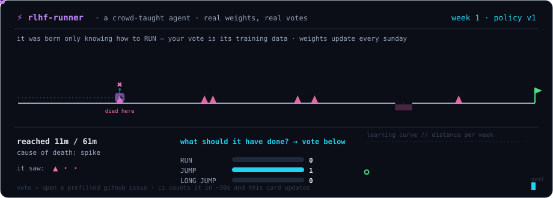

# rlhf-runner

**A tiny agent that learns a platformer level from real human votes — retrained by CI every Sunday.**

<p align="center">
  
</p>

## 🗳 Teach it — one click

The robot died. Tell it what it should have done at the spot where it died:

<p align="center">
  <a href="https://github.com/PhongCT1105/rlhf-runner/issues/new?title=vote%3A%20RUN&body=Just%20press%20%E2%80%9CSubmit%20new%20issue%E2%80%9D.%20CI%20counts%20your%20vote%2C%20updates%20the%20card%2C%20and%20closes%20this%20issue%20automatically.%20Vote%20again%20any%20time%20%E2%80%94%20your%20latest%20vote%20is%20the%20one%20that%20counts."></a>
  <a href="https://github.com/PhongCT1105/rlhf-runner/issues/new?title=vote%3A%20JUMP&body=Just%20press%20%E2%80%9CSubmit%20new%20issue%E2%80%9D.%20CI%20counts%20your%20vote%2C%20updates%20the%20card%2C%20and%20closes%20this%20issue%20automatically.%20Vote%20again%20any%20time%20%E2%80%94%20your%20latest%20vote%20is%20the%20one%20that%20counts."></a>
  <a href="https://github.com/PhongCT1105/rlhf-runner/issues/new?title=vote%3A%20LONG%20JUMP&body=Just%20press%20%E2%80%9CSubmit%20new%20issue%E2%80%9D.%20CI%20counts%20your%20vote%2C%20updates%20the%20card%2C%20and%20closes%20this%20issue%20automatically.%20Vote%20again%20any%20time%20%E2%80%94%20your%20latest%20vote%20is%20the%20one%20that%20counts."></a>
</p>

Pressing a button opens a pre-filled issue — just submit it. Within ~30 seconds a GitHub Action counts your vote, updates the tallies on the card above, thanks you, and closes the issue. One vote per GitHub account; voting again changes your vote.

## The loop

```
   the agent runs the level with its current weights (policy.json)
                     │
                     ▼
        it dies somewhere — the card shows the exact
        3-cell pattern it saw when it made the fatal choice
                     │
                     ▼
   humans vote what it should have done there  ←── you are here
                     │
                     ▼
   every vote is appended to dataset.jsonl — the permanent
   training set. nothing is ever thrown away.
                     │
                     ▼
   Sunday 00:00 UTC: CI rebuilds the policy from the ENTIRE
   dataset in one batch step — per state, each teacher's latest
   label counts once, and the aggregated counts ARE the weights
                     │
                     ▼
        next week's replay shows whether the crowd was right
```

The agent was initialized knowing only how to `RUN`. Everything else it knows, people taught it — and because training is a pure function of the ledger, `policy.json` is reproducible from `dataset.jsonl` at any point in history.

## Why this exists

Most profile animations are decoration: your click changes nothing. Here the click is the whole point — it fires CI, lands in a JSON ballot, and on Sunday it literally becomes model weights. It's the smallest honest version of learning from human feedback:

- a real environment (deterministic side-scroller, `level.json`)
- a real policy (tabular — state pattern → action scores, `policy.json`)
- a real dataset (`dataset.jsonl`, append-only — every vote ever cast, kept forever)
- real training (weekly batch rebuild from the full dataset, in CI, weights committed)
- a real learning curve (distance per week, on the card)

And one emergent bonus: patterns are position-independent, so teach it to jump one spike and it clears *every* identical spike — small-scale generalization you can watch happen.

**Honest scope:** this is behavior cloning from crowd labels on a tabular policy — the mechanics of RLHF's data pipeline, not PPO on a reward model. That's deliberate: every part is inspectable in ~300 lines of stdlib Python.

## Architecture

```
level.json      the world: track length + obstacle map
dataset.jsonl   append-only ledger of every vote ever cast — the actual
                training data; the policy is derived from it
policy.json     the weights — rebuilt each Sunday from the full dataset
votes.json      the current question + this week's live tally (a view,
                not the source of truth)
state.json      week counter + full history (the learning curve)
replay.svg      the live card, regenerated on every vote and every training run
scripts/
  engine.py       simulator: states, actions, deaths
  rollout.py      greedy run + SVG renderer (SMIL, static-first)
  record_vote.py  parses "vote: X" issues — only known actions accepted,
                  arbitrary text can never reach the card
  train.py        Sunday: majority label → weight update → new replay
.github/workflows/
  vote.yml        on issue open: count, refresh card, reply, close
  weekly.yml      cron: train once a week
```

## Run it yourself

```bash
python3 scripts/rollout.py   # simulate + render replay.svg
python3 scripts/train.py     # apply this week's votes (what CI runs on Sundays)
```

No dependencies — Python stdlib only.

---

<sub>Part of the <a href="https://github.com/PhongCT1105">self-updating profile system</a> · inspired by <a href="https://github.com/marcizhu/readme-chess">marcizhu/readme-chess</a>, where this "your click actually does something" idea comes from.</sub>
